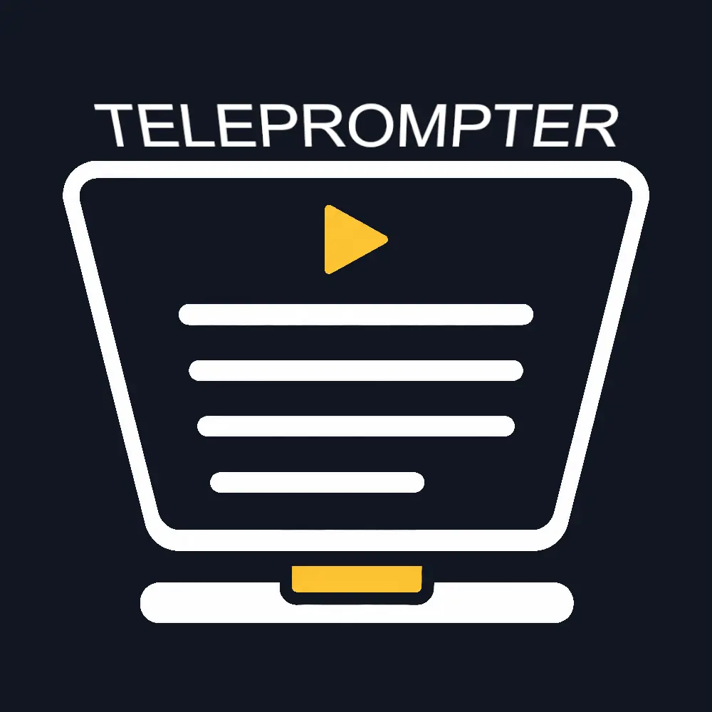
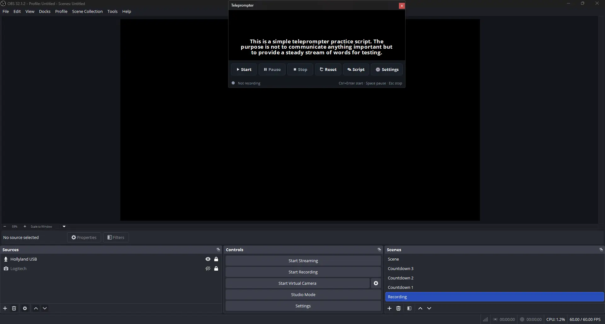
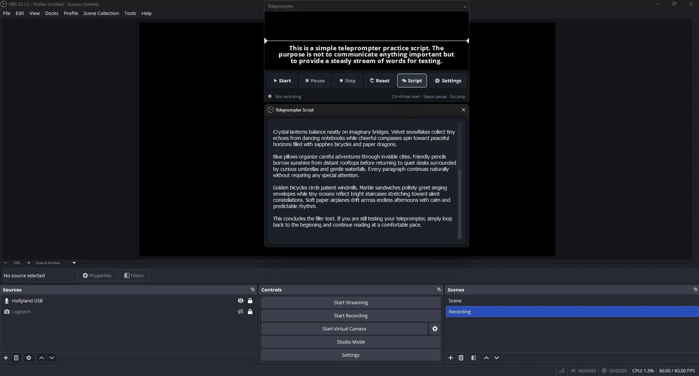
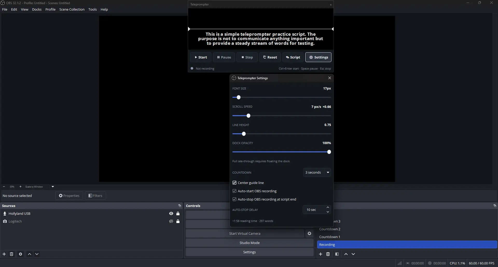
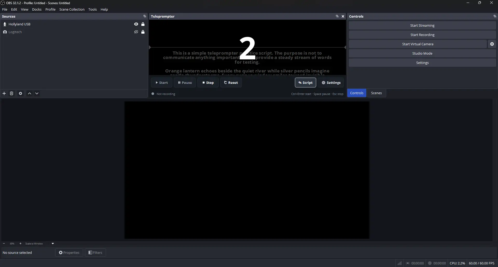
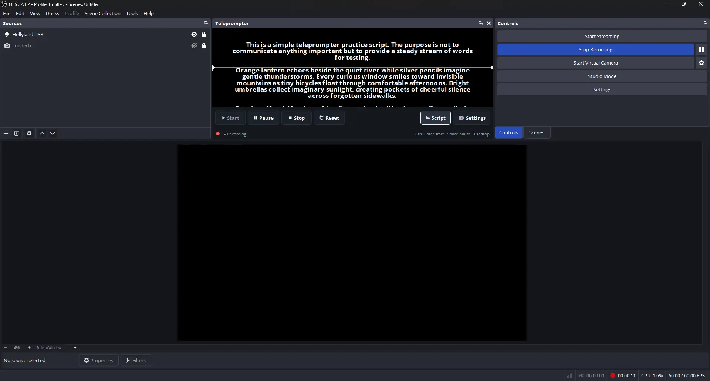

# Docked Teleprompter

<p align="center">
  
</p>

A free, third-party teleprompter dock for OBS Studio. It adds a teleprompter dock right
inside OBS. Install it once, launch OBS, and the **Teleprompter** dock is already there — no
Custom Browser Dock setup, no `file://` URL, no WebSocket host/port/password to configure.

> **Not affiliated with or endorsed by the OBS Project.** This is an independent, third-party
> tool that extends OBS Studio.

Paste a script, press **Start** — a countdown runs, OBS starts recording automatically, and
the script scrolls smoothly. Press **Stop** and it halts both the scroll and the recording
together. Everything is local; nothing is sent anywhere.

---

## Screenshots

| The dock, in OBS | Script editor |
|:---:|:---:|
|  |  |
| **Settings** | **Countdown → record** |
|  |  |



---

## Features

- 🎬 **Countdown → auto-record → auto-scroll.** Start runs a configurable countdown (0/3/5/10s),
  then OBS starts recording and the script begins scrolling the instant recording is confirmed.
- 🔌 **In-process OBS control.** Recording is driven directly through the OBS frontend API — no
  WebSocket, no connection to configure. It detects when OBS is already recording and reuses that
  session instead of double-starting, and it never starts scrolling on an unconfirmed recording.
- ✍️ **Paste-and-go script editor** with automatic local save/restore. Handles long scripts.
- 🎛️ **Live adjustable** font size, scroll speed, and line height. Smooth (sub-pixel) scrolling.
- ⏱️ Estimated reading time and word count.
- 🌙 Dark, high-contrast theme with an optional **center guide line**.
- ⌨️ Keyboard shortcuts: **Ctrl+Enter** = Start, **Space** = Pause/Resume, **Esc** = Stop.
- 💾 Everything persists locally across OBS restarts (script, font, speed, line height, countdown,
  layout) — in the plugin's config dir, no cloud, no accounts.

## Requirements

- **OBS Studio 31 or newer** (Qt6 build). That's it — the teleprompter is a native dock once
  installed. (The prebuilt installers target the OBS 31 ABI; to build against an older OBS,
  see [`BUILD.md`](./BUILD.md).)

## Install

There are two ways to install — an **installer** for your OS, or a **portable folder** you place
in OBS's plugin directory. Both make the **Teleprompter** dock appear automatically the next time
you launch OBS (no Custom Browser Dock, no URL, no WebSocket config). On Windows, the installer
is recommended because OBS does not scan the per-user Roaming/AppData plugin path.

> The links below always point at the newest release (GitHub's `latest/download` redirect). The
> full list of assets for any version is on the
> [**Releases**](https://github.com/merkrahq/obs-teleprompter/releases) page.

### Option A — installer

| OS | Download | Then |
|---|---|---|
| **Linux** | [`obs-teleprompter-linux-x86_64.deb`](https://github.com/merkrahq/obs-teleprompter/releases/latest/download/obs-teleprompter-linux-x86_64.deb) | `sudo apt install ./obs-teleprompter-linux-x86_64.deb` (pulls deps) or `sudo dpkg -i obs-teleprompter-linux-x86_64.deb` |
| **Windows** | [`obs-teleprompter-windows-x86_64.exe`](https://github.com/merkrahq/obs-teleprompter/releases/latest/download/obs-teleprompter-windows-x86_64.exe) | Run the installer |
| **macOS** | [`obs-teleprompter-macos.pkg`](https://github.com/merkrahq/obs-teleprompter/releases/latest/download/obs-teleprompter-macos.pkg) | Open the `.pkg` and follow the steps |

### Option B — portable folder (manual install)

Download the compressed folder for your OS, **unzip it**, and drop the resulting
`obs-teleprompter` folder into your OBS plugins directory.

| OS | Download | Drop the `obs-teleprompter` folder into |
|---|---|---|
| **Linux** | [`obs-teleprompter-linux-portable.zip`](https://github.com/merkrahq/obs-teleprompter/releases/latest/download/obs-teleprompter-linux-portable.zip) | `~/.config/obs-studio/plugins/` |
| **Windows** | [`obs-teleprompter-windows-portable.zip`](https://github.com/merkrahq/obs-teleprompter/releases/latest/download/obs-teleprompter-windows-portable.zip) | `%ProgramData%\obs-studio\plugins\` |
| **macOS** | [`obs-teleprompter-macos-portable.zip`](https://github.com/merkrahq/obs-teleprompter/releases/latest/download/obs-teleprompter-macos-portable.zip) | `~/Library/Application Support/obs-studio/plugins/` |

Each zip contains a single `obs-teleprompter/` folder in OBS's plugin layout
(`bin/64bit/` + `data/`). After dropping it in, restart OBS.

> A system `.tar.gz` (Linux) is also attached for packagers — it extracts over `/usr`. For a
> plain drag-in, use the **portable** zip above, not the `.tar.gz`.
>
> Windows manual portable install may require administrator permission to write under
> `%ProgramData%`. The `.exe` installer handles the correct Windows OBS plugin location for you.

### ⚠️ Unsigned — one-time OS override

The Windows/macOS artifacts are currently **unsigned** (code-signing certificates aren't held
yet), so your OS may warn you the first time:

- **Windows / SmartScreen:** if you see "Windows protected your PC," click **More info → Run
  anyway**.
- **macOS / Gatekeeper:** if the `.pkg` is blocked, **right-click it → Open** (instead of
  double-clicking), or clear the quarantine flag:
  `xattr -dr com.apple.quarantine obs-teleprompter-macos.pkg`.

The Linux `.deb`/`.zip`/`.tar.gz` need no such override. Signing/notarization will be added once
certs are in place; until then these steps are expected and safe for artifacts downloaded from the
official Releases page.

## Use

1. Open the **Teleprompter** dock (Docks → Teleprompter if it isn't already visible).
2. Open **✎ Script** and paste your script.
3. Adjust font size / scroll speed / line height / countdown to taste.
4. Press **▶ Start** (or Ctrl+Enter). Countdown → OBS records → the script scrolls.
5. **Space** pauses/resumes; **⏹ Stop** (or Esc) stops scrolling *and* recording.

If OBS is already recording when you press Start, the teleprompter reuses that recording rather
than starting a second one.

## Building from source

See [`BUILD.md`](./BUILD.md). In short (Linux):

```sh
sudo apt-get install -y cmake ninja-build build-essential \
  obs-studio libobs-dev qt6-base-dev qt6-base-private-dev
cmake -S . -B build -G Ninja -DCMAKE_BUILD_TYPE=RelWithDebInfo
cmake --build build
cd build && cpack               # → obs-teleprompter-*-Linux.deb + .tar.gz
```

The per-OS installers are produced in CI by
[`.github/workflows/build.yml`](./.github/workflows/build.yml) (Linux `.deb`/`.tar.gz`, Windows
NSIS `.exe`, macOS `.pkg`) and published to Releases on a version tag.

## Privacy

Fully local. No accounts, no telemetry, no cloud. The plugin controls OBS in-process (no network
connection at all) and stores its settings in OBS's local plugin config directory.

## Reference / fallback: the single-file browser dock

The repo also contains [`index.html`](./index.html) — the original single-file browser-dock
version that controls OBS over **OBS WebSocket v5**. The native plugin above is the primary,
recommended way to use the teleprompter; `index.html` is retained as a zero-install reference and
fallback (e.g. for an OBS build without the plugin). It works as a **Docks → Custom Browser
Docks…** entry pointed at the local file.

## License

[MIT](./LICENSE) — free and open source.
